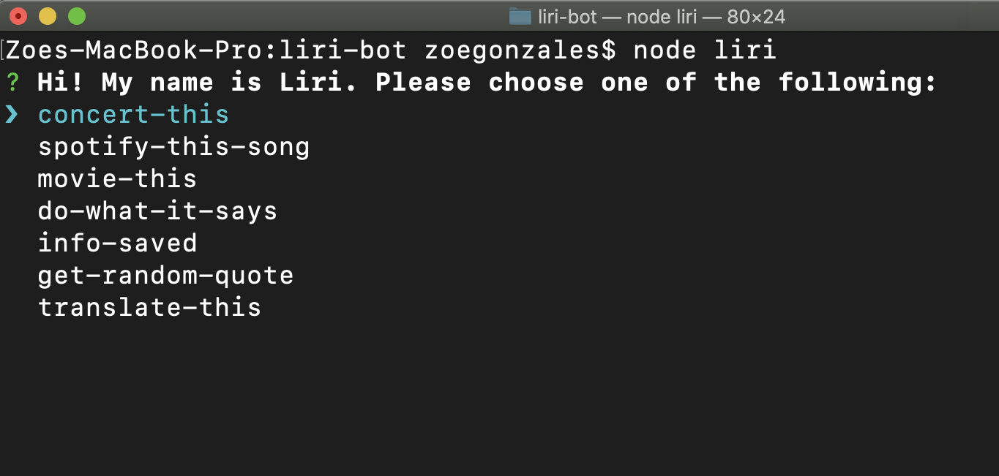

# liri-bot

## Summary
Liri-bot is a CLI app created in Node that takes in user input (musical artists, songs, and movie titles) and returns information about each of those inputs.

### Node packages used
dotenv, axios, moment, inquirer, colors, owl-wisdom, spotify-node-api

### APIs
BandsInTown, Spotify, OMDB

### How to install
* Open terminal or git bash and clone the repository to the directory of your choice
* Enter ` npm install ` or ` npm i ` to install the node packages needed to run the app
* **Note:** A local .env file containing the Spotify API id and secret will need to be provided. Spotify id and secret can be obtained [here](https://developer.spotify.com/)

### How to use
* Once you have the necessary files to run liri-bot, enter ` node liri `
* You'll see the following menu:

* Select one of the items in the menu to get data from liri

### concert-this
* Once selected, enter an artist and press ` enter `. If nothing is entered, liri will return concerts for Unknown Mortal Orchestra.
* Call to the BandsInTown API will return details about upcoming concerts such as: artist, venue, location (city, state within US; city, country outside US), date/time, and a link to the event's page on bandsintown.com.

### spotify-this-song
* Enter a song title and press ` enter `. If no song is entered, liri will return information about *No Scrubs* by TLC.
* Call to the Spotify API will return details about the song such as: title, artist, release date, album title, and a link to the song on Spotify.

### movie-this
* Enter a movie title to search and press ` enter `. If no movie is entered, liri will return information about *Amélie*.
* Call to the OMDB API will return details about the movie such as: title, release date, IMDB and Rotten Tomatoes ratings, director, country (or countries) where it was produced, language(s), plot, and actors.

### do-what-it-says
* When selected, this request returns details about either a movie, concerts, or a song. This defaults to the values held in random.txt.
* Liri chooses which request to run and what value to provide it by randomly generating a number representing that request's index in an array.
* This data is not affected by user input.

### info-saved
* When run, this request re-prints all of the data (concerts, songs, movies) that has previously been requested by the user. This does not include the data from do-what-it-says.

### get-random-quote
* Request provides a random owl quote from the owl-wisdom package.

